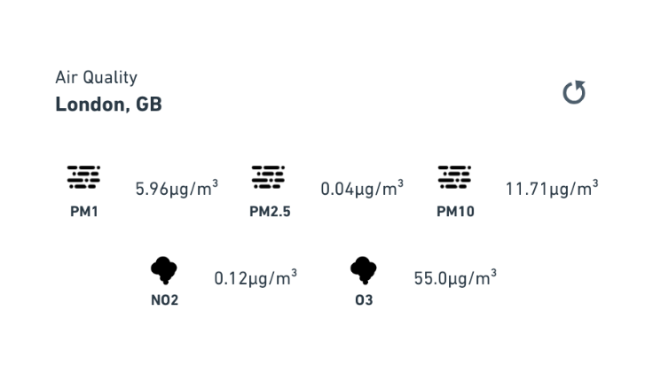

= JUXT Tech Test

== Test instructions

This repository contains a boilerplate ClojureScript app, based on the leiningen figwheel template.

Your task is to follow the steps below to build a simple air quality component and submit a private repository forked from this one.

Your repo should contain:

- The codebase itself
- A test suite (whatever seems appropriate)
- A description of what you could have done better given more time
- A screenshot of your app

Try to treat this as you would a professional project with multiple people on the team (e.g. keep code clean, use good commit messages etc). This is more important than actually finishing all the tasks.

We don’t expect the application to be production level quality. However, we’re interested in your thinking process, and are looking for you to identify decisions you make which would be different if you were given the time to build this in a more complete way.

Try to limit yourself to no more than 3 hours, as in the real world, there is more work to be done here than time available, so part of the test is how you manage your time.

== Tasks

The tasks are split in to different parts to make it easier to discuss during the review. Each part builds on top of the last.

=== Part 1

Your task is to build a component which provides details of the air quality for a particular city. The key measurements for air quality are particle size (PM1, PM2.5 and PM10) and pollutants such as nitrogen dioxide (NO2) and ozone (O3), typically all measurements are given as µg/m³.

The screenshot above is purely an example, the important parts are the features and overall structure.

You can find the icons used here https://erikflowers.github.io/weather-icons/ although you do not need to use icons, you can have text labels if you want, as long as the result is clearly readable and has feature parity.

For this task you can hardcode all of the data to the values used in the screenshot, but try and keep in mind that the data will eventually come from an external source and not all measurements will be present for each location.

=== Part 2

You should now have a nice looking air quality component, but it isn't much use as it doesn't give the right information!

Using a location of your choice (somewhere in the UK) and the link:https://docs.openaq.org[OpenAQ API], fetch the data required when the page is loaded, and when the refresh icon is clicked. This link:http://jsfiddle.net/rx2q86z7/[jsfiddle] shows an example calling the OpenAQ API. 

=== Part 3

In this task we will expand our app to check the air quality in a range of locations. Using the data available from link:https://raw.githubusercontent.com/lutangar/cities.json/master/cities.json[this URL], give the end user a way to search for a location and select it. Once selected, the air quality data for that location should be displayed in the card. *N.B.* OpenAQ has limited support for latitude and longitude coordinates, you may prefer using country code and city.

== Setting up the project

The existing code is based off a lein figwheel template with the cljs-ajax dependency added for making http requests.
You shouldn't need to add any new dependencies to complete the tasks, though you can if you feel it is beneficial to do so.

To get an interactive development environment run:

----
lein fig
----

and open your browser at http://localhost:9510/

This will auto compile and send all changes to the browser without the
need to reload. After the compilation process is complete, you will
get a Browser Connected REPL. An easy way to try it is:

----
(js/alert "Am I connected?")
----

and you should see an alert in the browser window.

To clean all compiled files:

----
lein clean
----

To create a production build run:

----
lein do clean, cljs-prod
----

And open your browser in `resources/public/index.html`. You will not get live reloading, nor a REPL.

== License

The MIT License (MIT)

Copyright © 2020 JUXT LTD.

Permission is hereby granted, free of charge, to any person obtaining a copy of this software and associated documentation files (the "Software"), to deal in the Software without restriction, including without limitation the rights to use, copy, modify, merge, publish, distribute, sublicense, and/or sell copies of the Software, and to permit persons to whom the Software is furnished to do so, subject to the following conditions:

The above copyright notice and this permission notice shall be included in all copies or substantial portions of the Software.

THE SOFTWARE IS PROVIDED "AS IS", WITHOUT WARRANTY OF ANY KIND, EXPRESS OR IMPLIED, INCLUDING BUT NOT LIMITED TO THE WARRANTIES OF MERCHANTABILITY, FITNESS FOR A PARTICULAR PURPOSE AND NONINFRINGEMENT. IN NO EVENT SHALL THE AUTHORS OR COPYRIGHT HOLDERS BE LIABLE FOR ANY CLAIM, DAMAGES OR OTHER LIABILITY, WHETHER IN AN ACTION OF CONTRACT, TORT OR OTHERWISE, ARISING FROM, OUT OF OR IN CONNECTION WITH THE SOFTWARE OR THE USE OR OTHER DEALINGS IN THE SOFTWARE.
